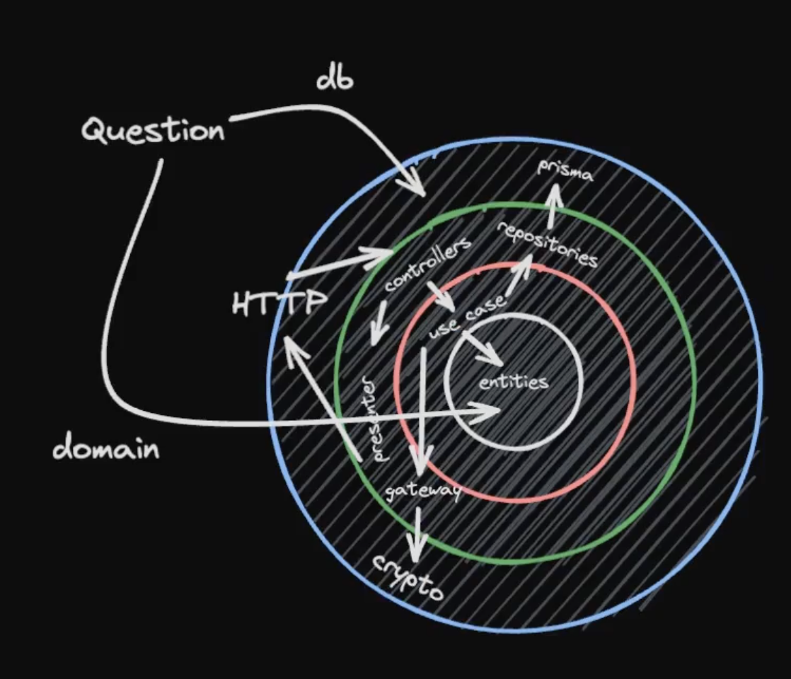

<p align="center">
  <a href="http://nextime.com.br/" target="blank"></a>
</p>

[circleci-image]: https://img.shields.io/circleci/build/github/nestjs/nest/master?token=abc123def456
[circleci-url]: https://circleci.com/gh/nestjs/nest

  <p align="center">
A project by NeXTIME using NestJS, created to serve as a template for future projects.</p>
    <p align="center">
<a href="https://www.npmjs.com/~nestjscore" target="_blank"></a>
<a href="https://www.npmjs.com/~nestjscore" target="_blank"></a>
<a href="https://www.npmjs.com/~nestjscore" target="_blank"></a>
<a href="https://circleci.com/gh/nestjs/nest" target="_blank"></a>
<a href="https://coveralls.io/github/nestjs/nest?branch=master" target="_blank"></a>
<a href="https://discord.gg/G7Qnnhy" target="_blank"></a>
<a href="https://opencollective.com/nest#backer" target="_blank"></a>
<a href="https://opencollective.com/nest#sponsor" target="_blank"></a>
  <a href="https://paypal.me/kamilmysliwiec" target="_blank"></a>
    <a href="https://opencollective.com/nest#sponsor"  target="_blank"></a>
  <a href="https://twitter.com/nestframework" target="_blank"></a>
</p>
  <!--[](https://opencollective.com/nest#backer)
  [](https://opencollective.com/nest#sponsor)-->

## Description

[Nest](https://github.com/nestjs/nest) framework TypeScript starter repository.

## License

Nest is [MIT licensed](LICENSE).

## Installation

```bash
$ pnpm install
```

## Running the app

```bash
# development
$ pnpm run start

# watch mode
$ pnpm dev

# production mode
$ pnpm run start:prod
```

## Test

```bash
# unit tests
$ pnpm run test

# e2e tests
$ pnpm run test:e2e

# test coverage
$ pnpm run test:cov
```

## Docker

### Docker Compose

O Docker Compose é usado para definir e gerenciar aplicações multi-containers no Docker, permitindo configurar todos os serviços de uma aplicação em um único arquivo YAML.

```bash
# é utilizado para iniciar todos os contêineres definidos no arquivo docker-compose.yml em segundo plano, permitindo que a aplicação funcione sem ocupar o terminal atual.
docker-compose up -d
```

```bash
docker ps
```

```bash
docker logs CONTAINER_ID
```

## Gerar e Converter Chaves RSA256 para Base64 no macOS

Para gerar chaves privadas e públicas RSA256 no macOS e convertê-las para o formato Base64, siga os passos abaixo utilizando o OpenSSL, que geralmente já vem instalado no sistema.

### Passo 1: Abra o Terminal

Abra o Terminal no seu Mac através do Spotlight (Command + Space e digite "Terminal").

### Passo 2: Gerar a Chave Privada

Execute o seguinte comando no Terminal para gerar uma chave privada RSA de 2048 bits:

```sh
openssl genpkey -algorithm RSA -out private_key.pem -pkeyopt rsa_keygen_bits:2048
```

Este comando irá criar um arquivo chamado private_key.pem contendo a chave privada.

### Passo 3: Gerar a Chave Pública

Use a chave privada para gerar a chave pública com o comando abaixo:

```sh
openssl rsa -pubout -in private_key.pem -out public_key.pem
```

Este comando irá criar um arquivo chamado public_key.pem contendo a chave pública.

### Passo 4: Converter a Chave Privada para Base64

Execute o seguinte comando para converter a chave privada para Base64:

```sh
base64 -i private_key.pem -o private_key_base64.txt
```

### Passo 5: Converter a Chave Pública para Base64

Execute o comando abaixo para converter a chave pública para Base64:

```sh
base64 -i public_key.pem -o public_key_base64.txt
```

### NestJS

#### Providers

Providers no NestJS são classes que podem ser injetadas e utilizadas por outros componentes, facilitando a reutilização de código e a implementação de injeção de dependências.

#### Pipe

Pipes no NestJS são usados para transformar dados de entrada ou validar dados antes que eles sejam manipulados pelos controladores. Eles atuam como intermediários, processando e transformando as requisições.

#### Guards

Guards no NestJS são usados para proteger rotas, determinando se uma requisição deve ser tratada pelo controlador com base em certas condições, como a autenticação e autorização do usuário.

### Authentication

[NestJS Authentication](https://docs.nestjs.com/security/authentication)

### File upload

[NestJS File Upload](https://docs.nestjs.com/techniques/file-upload)

O uso de buffer implica carregar todo o arquivo na memória antes de processá-lo, o que não é eficiente para arquivos grandes devido ao alto consumo de memória. Para lidar com arquivos grandes, como vídeos ou áudios, é mais eficaz utilizar a estratégia de streaming, que processa os dados em pequenos blocos, permitindo o processamento contínuo sem a necessidade de carregar o arquivo inteiro na memória. Isso evita problemas de desempenho e alocação de recursos.

## Padrões do Projeto

### Requisições

Prefixos utilizados:

#### use-cases

- `get`: para requisições que trazem apenas um item.
- `fetch`: para requisições que trazem uma listagem.

#### repositories

- `findBy`: para requisições que trazem apenas um item.
- `findMany`: para requisições que trazem uma listagem.

## Arquitetura do projeto




## Orientação a Objetos

Em orientação a objetos, as palavras-chave `private` e `protected` são usadas para controlar o acesso aos membros (atributos e métodos) de uma classe. Aqui está a diferença entre elas:

### `private`

- **Acesso Restrito à Própria Classe**: Um membro `private` só pode ser acessado dentro da própria classe em que é declarado. Ele não pode ser acessado por nenhuma outra classe, nem mesmo por classes derivadas (subclasses).
- **Encapsulamento**: É usado para esconder detalhes de implementação da classe, garantindo que os membros `private` não sejam acessados ou modificados diretamente de fora da classe.

```typescript
class Animal {
  private name: string

  constructor(name: string) {
    this.name = name
  }

  private getName(): string {
    return this.name
  }
}
```

### `protected`

- **Acesso Restrito à Classe e Subclasses**: Um membro `protected` pode ser acessado dentro da própria classe em que é declarado e também por todas as classes que herdam dessa classe (subclasses). No entanto, ele não pode ser acessado por outras classes que não fazem parte da hierarquia de herança.
- **Herança**: É usado para permitir que subclasses tenham acesso aos membros protegidos da classe base, facilitando a reutilização de código e a extensão da funcionalidade da classe base.

```typescript
class Animal {
  protected name: string

  constructor(name: string) {
    this.name = name
  }

  protected getName(): string {
    return this.name
  }
}

class Dog extends Animal {
  public getDogName(): string {
    return this.getName() // Acesso permitido
  }
}
```

### Resumo

- `private`: Membros só podem ser acessados dentro da própria classe.
- `protected`: Membros podem ser acessados dentro da própria classe e em subclasses.

Essas regras ajudam a definir a visibilidade e o encapsulamento, elementos importantes na construção de sistemas robustos e bem estruturados.

## DDD

### Domínio

O domínio (domain) refere-se a um conjunto de conceitos, regras, processos e comportamentos que são fundamentais para um determinado negócio ou aplicação. É a área de conhecimento que descreve e organiza todo o conhecimento e entendimento necessário para desenvolver um software que atenda às necessidades do negócio ou aplicação.

O domínio é a base do DDD e é a partir dele que os modelos de negócio são construídos. Ele é composto por um conjunto de entidades, agregados, serviços e eventos que representam conceitos fundamentais do negócio. O conhecimento do domínio é essencial para que os desenvolvedores possam entender as necessidades do negócio e construir um software que atenda a essas necessidades de forma eficiente e eficaz.

Além disso, o DDD enfatiza a importância da comunicação clara e constante entre os desenvolvedores e os especialistas do domínio (conhecidos como especialistas do domínio ou domain experts), para que o conhecimento do domínio possa ser compartilhado e incorporado ao processo de desenvolvimento de software.

### Entidades

As entidades (entities) são objetos de domínio que representam conceitos importantes do negócio. Elas são responsáveis por encapsular o estado e o comportamento relacionado a esses conceitos, e são fundamentais para a modelagem do domínio.

Uma entidade é caracterizada por ter uma identidade única e constante, que a diferencia de outras entidades do mesmo tipo.

Elas são importantes para o DDD porque elas representam as principais abstrações do domínio, e a sua correta modelagem ajuda a garantir que o software reflita de forma precisa as regras e o comportamento do negócio. Além disso, as entidades costumam ser o ponto de entrada para outras operações do sistema, como validações, cálculos e regras de negócio específicas.

### Casos de uso

Os casos de uso (use cases) são uma técnica para descrever os requisitos funcionais de um sistema. Eles descrevem uma interação específica entre o usuário e o sistema, mostrando quais ações o usuário realiza e como o sistema responde a essas ações.

Eles são uma parte importante do processo de desenvolvimento de software, pois ajudam a definir os requisitos do sistema e a garantir que ele atenda às necessidades dos usuários finais.

### Linguagem ubíqua

A linguagem ubíqua (ubiquitous language) é uma técnica que consiste em usar uma linguagem comum, compreensível tanto para desenvolvedores quanto para especialistas do domínio, para descrever e entender os conceitos e processos do domínio em questão.

Ela é importante porque ajuda a alinhar a comunicação entre os membros da equipe de desenvolvimento e os especialistas do domínio. Usando uma linguagem comum, todos os envolvidos no projeto podem ter uma compreensão compartilhada dos termos e conceitos-chave do domínio, facilitando o desenvolvimento de um software que atenda às necessidades do negócio.

Além disso, ela deve ser incorporada no código-fonte do software e em documentos relacionados, como diagramas e documentação técnica, para garantir que todos os envolvidos usem a mesma terminologia. Dessa forma, a linguagem ubíqua ajuda a garantir que o software seja construído para atender às necessidades do negócio e que todos os envolvidos no projeto estejam na mesma página.

## Aggregate (Agregados)

é um conjunto de objetos que são tratados como uma unidade para fins de consistência de dados. O Aggregate define um boundary (limite) que protege a consistência do seu conteúdo ao impor regras de negócio invariantes.

Um agregado (aggregate) é um conjunto de objetos de domínio que são tratados como uma unidade coesa. Eles são usados para delimitar transações consistentes de mudança de estado dentro do domínio.

Um agregado tem uma raiz de agregado (aggregate root), que é uma única entidade que é responsável por garantir a consistência do agregado como um todo. A raiz do agregado é a única entidade que pode ser referenciada de fora do agregado. Todas as outras entidades dentro do agregado só podem ser acessadas através da raiz do agregado.

O uso deles é uma das principais técnicas para gerenciar a complexidade em sistemas de software baseados em DDD. Ao definir os limites do agregado, é possível criar um modelo de domínio mais claro e focado, com transações e responsabilidades bem definidas para cada objeto no agregado.

Aqui estão os principais conceitos relacionados aos Aggregates:

1. **Root (Raiz)**: Cada Aggregate possui uma entidade raiz que é a única responsável por garantir a integridade do Aggregate. A entidade raiz é a única através da qual o Aggregate pode ser referenciado e manipulada diretamente.

2. **Boundary (Limite)**: O Aggregate define um boundary claro dentro do qual as regras de consistência de negócios são aplicadas. Objetos dentro do Aggregate podem ser entidades ou objetos de valor.

3. **Consistência**: O Aggregate garante a consistência das mudanças dentro do seu boundary. Toda alteração deve ser feita através da entidade raiz para assegurar que as regras de negócio sejam mantidas.

4. **Transações**: O Aggregate é a unidade de atualização atômica. Isso significa que todas as operações que alteram o estado de um Aggregate são feitas dentro de uma única transação.

### Exemplo de Uso de Aggregate

Imagine um cenário de um sistema de pedidos de e-commerce. Um pedido pode ter múltiplos itens, cada um com seu próprio estado. Neste caso, o `Order` pode ser um Aggregate, e `OrderItem` pode ser uma entidade dentro desse Aggregate. A entidade raiz `Order` garante a integridade e consistência do pedido e seus itens.

```typescript
// Entidade Raiz do Aggregate
class Order {
  private orderId: string
  private items: OrderItem[] = []

  constructor(orderId: string) {
    this.orderId = orderId
  }

  addItem(productId: string, quantity: number) {
    const item = new OrderItem(productId, quantity)
    this.items.push(item)
  }

  // Outros métodos de negócio para manipular o Aggregate
}

// Entidade dentro do Aggregate
class OrderItem {
  private productId: string
  private quantity: number

  constructor(productId: string, quantity: number) {
    this.productId = productId
    this.quantity = quantity
  }

  // Métodos de negócio para manipular o item do pedido
}
```

Neste exemplo, todas as alterações relacionadas aos itens do pedido são feitas através da entidade raiz `Order`, assegurando que as regras de consistência sejam mantidas dentro do boundary do Aggregate.

### Bounded Context

Bounded Context (contexto delimitado / subdomínio) é uma técnica para definir limites explícitos em torno de um conjunto de modelos de domínio. Cada Bounded Context é uma fronteira lógica que separa um modelo de domínio específico, com suas próprias regras, termos e limites, de outros modelos de domínio dentro do mesmo sistema.

Um Bounded Context pode ser visto como um subdomínio ou um setor de um sistema maior, onde as interações entre os objetos de domínio são altamente relacionadas. Dentro de um Bounded Context, as regras de negócio podem ser diferentes e podem ter nomes de entidades ou conceitos com significados distintos em outros contextos.

Essa técnica ajuda a evitar a confusão entre diferentes conceitos de negócio, evita a duplicação de código e reduz a complexidade do sistema. Cada Bounded Context pode ter sua própria arquitetura, padrões de projeto e tecnologias, permitindo que a equipe de desenvolvimento escolha as ferramentas mais adequadas para lidar com as especificidades do contexto.

Além disso, o DDD incentiva a comunicação clara e colaboração entre diferentes Bounded Contexts, por meio de integrações bem definidas e acordos claros de como os objetos de domínio serão compartilhados entre os contextos.

O estabelecimento de Bounded Contexts é uma parte importante da modelagem de um sistema baseado em DDD e deve ser conduzido em estreita colaboração entre a equipe de desenvolvimento e especialistas do domínio para garantir que as fronteiras do contexto sejam bem definidas e compreendidas.

### Value Objects

Um Value Object (objeto de valor) é uma classe que representa um valor que é importante para o domínio, mas que não possui identidade própria. Em outras palavras, um Value Object é um objeto que é definido pelos seus atributos, em vez de ser definido por uma identidade exclusiva.

Por exemplo, em um sistema de compras online, um Endereço pode ser modelado como um Value Object, pois não é importante manter um identificador único para cada endereço, mas sim os seus atributos, como rua, número, bairro, cidade, estado e CEP. Do ponto de vista do negócio, o endereço é apenas uma informação que precisa ser armazenada e consultada, não sendo uma entidade que precisa ser rastreada ou gerenciada.

Porém, é importante lembrar que nem todos os objetos sem identidade são necessariamente Value Objects. A decisão de modelar um objeto como um Value Object depende do contexto do domínio e da análise dos especialistas do negócio e da equipe de desenvolvimento.

### Eventos de domínio

Um evento de domínio (domain event) é uma notificação assíncrona que indica que algo importante aconteceu no domínio do sistema. Ele representa um fato ocorrido dentro do sistema que pode ser interessante para outras partes do sistema e pode ser usado para tomar decisões ou gerar novas ações.

Por exemplo, em um sistema de comércio eletrônico, um evento de domínio pode ser gerado quando uma nova compra é realizada com sucesso. Esse evento pode conter informações como o identificador da compra, o valor total, o endereço de entrega, entre outras informações relevantes para o domínio.

Eventos de domínio são importantes porque permitem que diferentes partes do sistema sejam notificadas e atualizadas quando ocorrem mudanças importantes no domínio. Eles também permitem que o sistema seja projetado de forma mais modular e escalável, pois diferentes partes do sistema podem ser projetadas para reagir a diferentes tipos de eventos, de forma independente.

## Watched List

é um padrão usado em Domain-Driven Design (DDD) e em outras arquiteturas de software para gerenciar coleções de objetos que precisam ser monitoradas para mudanças. É particularmente útil quando você precisa saber quais objetos foram adicionados, removidos ou modificados em uma coleção, sem a necessidade de fazer comparações dispendiosas entre estados antigos e novos da coleção.

### Características Principais da Watched List

1. **Rastreamento de Mudanças**: A lista mantém um registro das operações realizadas sobre ela (adições, remoções, modificações).

2. **Coerência com o Estado Atual**: Facilita a implementação de regras de negócio que dependem do estado atual da coleção, além de auxiliar na persistência apenas das mudanças ocorridas.

3. **Eventos**: Pode emitir eventos ou notificações quando mudanças ocorrem, permitindo que outras partes do sistema reajam a essas mudanças.

### Exemplo de Implementação

Vamos supor que você tenha um Aggregate `Order` que contenha uma lista de `OrderItems`. Usando uma Watched List, você pode monitorar as mudanças nos itens do pedido de forma eficiente.

```typescript
class WatchedList<T> {
  private currentItems: T[] = []
  private addedItems: T[] = []
  private removedItems: T[] = []

  addItem(item: T) {
    this.currentItems.push(item)
    this.addedItems.push(item)
  }

  removeItem(item: T) {
    const index = this.currentItems.indexOf(item)
    if (index > -1) {
      this.currentItems.splice(index, 1)
      this.removedItems.push(item)
    }
  }

  getCurrentItems(): T[] {
    return [...this.currentItems]
  }

  getAddedItems(): T[] {
    return [...this.addedItems]
  }

  getRemovedItems(): T[] {
    return [...this.removedItems]
  }

  clearChanges() {
    this.addedItems = []
    this.removedItems = []
  }
}

// Uso da Watched List dentro de um Aggregate
class Order {
  private orderId: string
  private items: WatchedList<OrderItem>

  constructor(orderId: string) {
    this.orderId = orderId
    this.items = new WatchedList<OrderItem>()
  }

  addItem(productId: string, quantity: number) {
    const item = new OrderItem(productId, quantity)
    this.items.addItem(item)
  }

  removeItem(item: OrderItem) {
    this.items.removeItem(item)
  }

  getItems(): OrderItem[] {
    return this.items.getCurrentItems()
  }

  getAddedItems(): OrderItem[] {
    return this.items.getAddedItems()
  }

  getRemovedItems(): OrderItem[] {
    return this.items.getRemovedItems()
  }
}
```

### Vantagens da Watched List

- **Eficiência**: Evita a necessidade de comparar listas inteiras para detectar mudanças, economizando recursos computacionais.
- **Clareza**: Facilita a leitura e manutenção do código, tornando explícitas as mudanças feitas na coleção.
- **Facilidade de Persistência**: Simplifica a implementação de persistência incremental, onde apenas as mudanças precisam ser persistidas, não a coleção inteira.

### Aplicações Comuns

- **Sistemas de Pedido**: Para rastrear alterações em itens de um pedido.
- **Gerenciamento de Inventário**: Para monitorar adições e remoções de itens de estoque.
- **Sistemas de Notificação**: Para emitir eventos ou notificações com base em mudanças na coleção.

A Watched List é uma técnica poderosa para manter o controle de mudanças em coleções de objetos, proporcionando maior eficiência e clareza na implementação de regras de negócio e persistência de dados.

## Subdomínios

- Core: O que dá dinheiro
- Supporting: Dá suporte para o core funcionar
- Generic: Você precisa, mas não são tão importantes

### Exemplo E-commerce

### Core

- Compra
- Catálogo
- Estoque
- Pagamento
- Entrega
- Faturamento

### Supporting

- Estoque

### Generic

- Notificação ao cliente
- Promoções
- Chat

### Pub/Sub
